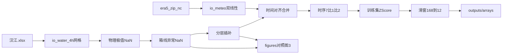

# MD-DySTGCN 预处理代码与可视化检验计划

对照论文第3章流程，对接工作区**已有原始数据**，设计 Python 包与检验图（对齐 [图片/图3-2.jpg](c:\Users\27330\Desktop\cursor\图片\图3-2.jpg)～图3-5）。

## 1. 原始数据实勘结论（已核对）

### 水质：[`原始数据/汉江.xlsx`](c:\Users\27330\Desktop\cursor\原始数据\汉江.xlsx)

| Sheet | 作用 | 关键字段 |
|-------|------|---------|
| Sheet2 | 监测记录 ~141023 行 | `断面名称`, `监测时间`, `水温(℃)`, `pH`, `溶解氧(mg/L)`, `高锰酸盐指数(mg/L)`, `氨氮(mg/L)`, `总磷(mg/L)`, `总氮(mg/L)`, `电导率(μS/cm)`, `浊度(NTU)` |
| Sheet1 | 站点元数据 16 行 | `断面`, `经度`, `纬度`（含误入的卫河「小河口」，**不可直接当表3-1**） |

- 时间范围：`2021-01-01 00:00` ~ `2025-05-31 20:00`（与论文一致）
- 主采样间隔 4h；存在 8h/12h 缺口，需先对齐到完整 4h 网格
- Sheet2 实际有 **18** 个断面名；除论文 16 站外多出 `南柳渡`、`黄金峡` → **只保留表3-1 十六站**
- 叶绿素/藻密度大量 `-2` 哨兵值；论文 9 参数**不含**这两列，直接丢弃

### 气象：[`原始数据/hanjiang(原始气象数据)/era5_land_YYYY_MM.nc`](c:\Users\27330\Desktop\cursor\原始数据)

- 外表 `.nc` 实为 **ZIP**，内含 HDF5/NetCDF4 `data_0.nc`（用 `h5netcdf` 打开）
- 变量：`tp`(accum,m)、`sro`(accum,m)、`t2m`(instant,K)、`u10`/`v10`(instant,m/s)
- **已是 4h 步长**（00/04/08/12/16/20），非论文字面「1h 再聚合」→ 复现时：**瞬时量直接时刻对齐；累积量把该 4h 时刻值当作窗口累积通量**（等价于原文对 `[t-3,t]` 小时求和后的结果），并换算 `m→mm`、`K→℃`，风速 `sqrt(u10²+v10²)`
- 网格约 **0.1°** ERA5-Land，覆盖 lon∈[106.06,114.36]、lat∈[30.04,33.24]（覆盖表3-1 全部站点）

### 论文检验图样式（可视化必须对齐）

| 图 | 站点/内容 | 代码输出应对标 |
|----|-----------|----------------|
| 图3-2 | 汉南村 9 参数 3×3 折线 | 清洗后全时段九宫格 |
| 图3-3 | 宗关 WT / NH3-N / DO 原始（可见断点） | 插补前三行堆叠 |
| 图3-4 | 同上，红=算法填补，彩=原始观测 | 插补后叠加填补掩码着色 |
| 图3-5 | NH3-N：(a)箱线+阈值 (b)时序标红异常点 | 异常检测阶段左右双子图 |

---

## 2. 工程目录与 Py 文件设计

```
cursor/
  preprocess/
    __init__.py
    config.py          # 路径、表3-1站序、列映射、物理阈值、Tin/Tout
    io_water.py        # Excel → [T,N,C] 原始面板 + 缺失掩码
    io_meteo.py        # ZIP-NC → 双线性插值 → [T,N,4]
    clean.py           # 异常→NaN + 分层插补 + 填补掩码
    dataset.py         # A_mask、划分、Z-Score、滑窗落盘
    visualize.py       # 图3-2～3-5 + 气象抽检
    run_preprocess.py  # CLI 入口
  outputs/
    arrays/            # npy/npz/json
    figures/           # 检验图 png
  requirements-preprocess.txt
```

**不采用单文件巨型脚本**：IO / 清洗 / 构图 / 画图职责分离，入口只编排调用。

### `config.py` 固定约定

- 站序（与论文表3-1一致，自上而下）：
  `烈金坝→梁西渡→小钢桥→老君关→羊尾→陈家坡→沈湾→白家湾→余家湖→转斗→皇庄→罗汉闸→岳口→汉南村→小河→宗关`
- 坐标：**硬编码表3-1**（不用 Sheet1 的小河口）；与 Sheet1 汉江站交叉校验打印 diff
- 水质列映射：Excel 中文列 → `WT,pH,DO,COD_MN,NH3_N,TP,TN,EC,TURB`
- 参数类别（插补）：
  - 平稳：`WT,pH,EC` → 线性插值
  - 突变：`NH3_N,TP,TURB,TN` → ≤6 点线性，>6 点同期/滑窗均值（TN 原文未写，默认并入突变）
  - 复合：`DO,COD_MN` → 同突变型阈值混合
- 物理极值示例：`WT≥-5`，`0≤pH≤14`，`0≤DO≤20`，浓度类 `<0` 置 NaN，`EC==0` 视为无效

### 各模块职责（函数级）

**`io_water.py`**
- `load_station_table()` → DataFrame
- `load_raw_water()`：读 Sheet2，滤 16 站，`pivot` 为 MultiIndex 时间×站点
- `reindex_4h(start,end)`：完整 4h 网格，缺口变 NaN
- 返回：`water_raw[T,N,C]`，`time_index`，`obs_mask`（原始是否有观测）

**`io_meteo.py`**
- `iter_era5_months(dir)`：对每个 `.nc` ZIP 解压到临时目录，`xr.open_dataset(..., engine="h5netcdf")`
- `bilinear_extract(ds, lon, lat)`：对 16 站插值 `tp,sro,t2m,u10,v10`
- `to_model_meteo()`：单位换算 + 风速合成 → `[T,N,4]`，与水质 `time_index` inner/outer 对齐并报告缺口

**`clean.py`**
- `apply_physical_bounds` → NaN
- `boxplot_outliers(per station, per var, k=1.5)` → NaN，记录阈值
- `stratified_impute` → 填补后数组 + `impute_mask`（True=算法填补，供图3-4 红线）
- 顺序：**物理异常 → 箱线异常 → 分层插补**（对应图3-5 先检测、图3-4 再填补）

**`dataset.py`**
- `build_amask_chain(N=16)`：相邻上游→下游有向边（`A[i,i+1]=1` 按站序）
- `split_time_712`：时序 7:1:2
- `fit_zscore_train_only` → 水质+气象各通道 μ/σ
- `make_windows(Tin=168, Tout=12)` → `train/val/test.npz`（键：`X,M,Y`）
- 另存：`water_clean.npy`、`meteo.npy`、`A_mask.npy`、`scaler_stats.json`、`timestamps.csv`

**`visualize.py`（对照论文图）**
- `fig_hannancun_9grid` → 图3-2：汉南村 3×3
- `fig_zongguan_raw_stack` → 图3-3：宗关 WT/NH3-N/DO 插补前
- `fig_zongguan_impute_overlay` → 图3-4：原始彩色 + 填补段红色
- `fig_nh3n_boxplot_outliers` → 图3-5：左箱线+阈值虚线，右 2021 年时序黑线+红点异常
- `fig_meteo_align_check`：任选宗关，降水/气温与浊度同轴对照（论文无此图，作工程抽检）
- `fig_amask_heatmap`：河网掩码热力图

**`run_preprocess.py`**
```text
python -m preprocess.run_preprocess
  [--skip-meteo]   # 仅水质清洗+图，便于快速验图
  [--figures-only] # 已有中间结果时只重画
```

依赖：`pandas, openpyxl, numpy, xarray, h5netcdf, scipy, matplotlib`（写入 `requirements-preprocess.txt`）。

---

## 3. 数据处理流水线（实现时严格按此顺序）



与论文差异的**明确适配**（写入代码注释）：

1. ERA5 已是 4h → 不做小时求和，累积量直接用时刻值（mm）
2. Sheet2 多出断面 → 丢弃；Sheet1 小河口 → 忽略
3. TN 插补按突变型

---

## 4. 可视化检验验收标准

运行后 `outputs/figures/` 至少包含：

| 文件名 | 对照 | 通过条件 |
|--------|------|----------|
| `fig3_2_hannancun_9params.png` | 图3-2 | 9 子图齐全，时间轴 2021–2025 |
| `fig3_3_zongguan_raw.png` | 图3-3 | 可见原始断点/负值尖峰 |
| `fig3_4_zongguan_imputed.png` | 图3-4 | 红段仅出现在 `impute_mask=True` |
| `fig3_5_nh3n_outliers.png` | 图3-5 | 阈值线= Q3+1.5IQR；红点=越界点 |
| `meteo_zongguan_check.png` | 工程抽检 | 气象与水质时间戳一一对应、无大段错位 |
| `A_mask.png` | 拓扑 | 仅上三角邻接带（链式有向）非零 |

控制台打印：各站缺失率、异常点数、插补点数、ERA5 覆盖率、train μ/σ、样本数 `(n_train,n_val,n_test)`。

---

## 5. 落盘产物

```
outputs/arrays/
  water_raw.npy          # [T,16,9] 网格化未插补
  water_clean.npy        # [T,16,9]
  meteo.npy              # [T,16,4]  precip_mm, runoff_mm, temp_c, wind
  impute_mask.npy        # bool
  outlier_mask.npy       # bool
  A_mask.npy             # [16,16]
  scaler_stats.json
  timestamps.csv
  train.npz / val.npz / test.npz
outputs/figures/         # 上表 png
```

张量约定：`X∈R^{Tin×N×C}`，`M∈R^{Tin×N×D}`，`Y∈R^{Tout×N×C}`；评估时再切片宗关（本阶段不做模型训练）。

---

## 6. 实现边界

- **本计划只做预处理 + 检验可视化**，不实现 MD-DySTGCN 网络本身
- 不修改 `原始数据/`；所有结果写到 `outputs/`
- 中文字体：Windows 优先 `Microsoft YaHei`，避免图例乱码
