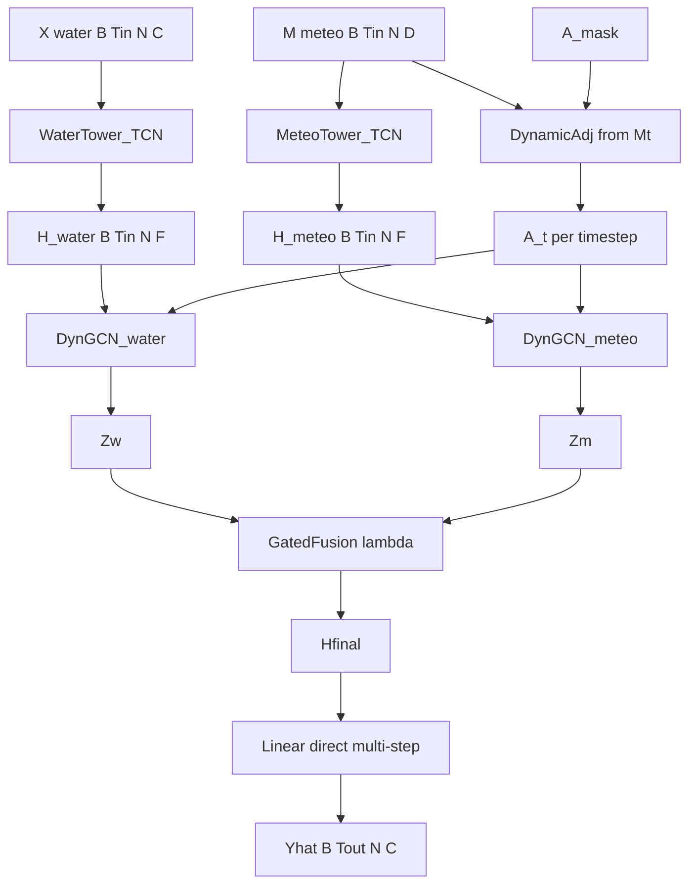

# MD-DySTGCN 模型复现计划

依据论文第4章（式4-3～4-14）、图4-1～4-4，以及已交付的 [`outputs/arrays`](c:\Users\27330\Desktop\cursor\outputs\arrays)（见 [交付说明_MD-DySTGCN预处理.md](c:\Users\27330\Desktop\cursor\交付说明_MD-DySTGCN预处理.md)）。**本阶段只复现 MD-DySTGCN 本体训练与宗关评估**，不实现表5-1 的 11 个基线与消融变体。

## 数据接口（已就绪，勿重做预处理）

| 产物 | 用途 |
|------|------|
| `train/val/test.npz` | 键 `X,M,Y`；形状 `X:[B,168,16,9]`，`M:[B,168,16,4]`，`Y:[B,12,16,9]`（已 Z-Score） |
| `A_mask.npy` | `[16,16]` 链式有向物理掩码 |
| `scaler_stats.json` | 反标准化算 MAPE |

评估：模型输出全流域 `Ŷ∈R^{B×12×16×9}`，指标只在 **宗关（索引 15）** 上算；RMSE/MAE/MSE 在标准化空间，MAPE 反标准化后算（与 §5.2 一致）。论文目标参考：测试 RMSE≈0.2649，MAPE≈7.67%。

## 架构对齐（图4-1 三阶段）



### 模块实现要点（严格按公式）

**1. 动态邻接（图4-2 / 式4-3～4-6）**
- 对每个时间步 `M_t ∈ R^{B×N×D}`：`E_t = ReLU(M_t W_E + b_E)`，`W_E: D→d_E`
- `S_t = E E^T / √d_E`，再 `A'_t = ReLU(MLP(S_t))`（对每个 `(i,j)` 标量或对矩阵做共享 MLP）
- `Ã = A' ⊙ A_mask`，再 **行 Softmax** 得 `A_t`（式4-6）
- 得到序列 `A ∈ R^{B×Tin×N×N}`

**2. 双塔 TCN（图4-3 / §4.2）**
- 两塔参数独立；每塔 `L=4` 残差块，核 `K=3`，膨胀 `1,2,4,8`
- 因果空洞卷积 + ReLU；残差支路 `1×1` 对齐通道
- 共享权重跨站点：把 `(B,Tin,N,C)` reshape 为 `(B*N, C, Tin)` 做 `Conv1d`，输出 `(B,Tin,N,F)`

**3. 动态图卷积（图4-4 / 式4-11）**
- 对水质/气象特征分别堆叠 `L_g` 层：`Z^{l+1} = ReLU( Â_t Z^l Θ^l )`，`Â = D̃^{-1/2} A_t D̃^{-1/2}`
- **流向约定**：当前 `A_mask[i,i+1]=1` 表示上游→下游边；聚合下游特征时用 **`A^T`（或加载时转置掩码）**，保证信息从上游传到下游（否则物理方向反了）
- 自环：实现时对 `A` 加 `I` 再归一化，避免孤立节点度为人零（论文 GCN 通式含自环；与掩码兼容）

**4. 门控融合 + 解码（式4-12～4-14）**
- `λ = σ(W_g [Z_w ‖ Z_m] + b_g)`，`H = λ⊙Z_m + (1-λ)⊙Z_w`
- **取最后时间步** `H[:,-1]`（`B,N,F`）经 Linear 直接映射为 `Tout×C`，reshape 为 `Ŷ (B,Tout,N,C)`（直接多步，非自回归）

### 原文未给出的超参（本计划固定默认）

| 符号 | 默认 | 依据 |
|------|------|------|
| `F`（TCN/GCN 隐维） | 64 | 常见时空图规模；可按显存调 |
| `d_E` | 32 | 嵌入维小于 F |
| `L_g` | 2 | 16 站链式 2 跳覆盖邻域 |
| MLP(S) | 2 层，隐维 64 | 图4-2 |
| Epochs / patience | 50 / 10 | 文中约 Epoch 25 击穿基线 |
| Huber `δ` | 1.0 | 标准化空间默认 |
| seed | 42 | 可复现 |

表5-2 已明确：`Tin=168, Tout=12, batch=64, lr=1e-3, AdamW wd=1e-4, Huber`。

## 代码目录

```
model/
  __init__.py
  layers.py          # ResidualTCNBlock, DynamicAdjacency, DynGCN
  md_dystgcn.py      # MDDySTGCN.forward(X, M, A_mask)
  dataset.py         # NPZ Dataset / DataLoader
  metrics.py         # RMSE/MAE/MSE（z-space）+ MAPE（反标准化，宗关）
  train.py           # 训练循环、早停、存 best.pt
  evaluate.py        # 测试集指标 + 可选预测曲线
  config.py          # 超参与路径（复用 preprocess 站序）
requirements-model.txt   # torch 等
```

训练入口：`python -m model.train` → 读 `outputs/arrays/*.npz`，写 `outputs/checkpoints/md_dystgcn_best.pt` 与 `outputs/metrics/test_metrics.json`。

## 训练与验收

1. Huber Loss 对 `Ŷ` 与 `Y` 全站全通道求平均（训练）；验证 loss 同
2. 验证集最优存盘；测试集打印宗关 RMSE/MAE/MAPE
3. 验收：损失曲线平稳下降；测试 RMSE 进入与论文同量级（目标逼近 0.26，不强制一次打到 0.2649）；抽检浊度等突变段预测图（对标图5-3 风格，可选）

## 实现边界

- 不重跑预处理；不改 `原始数据/`
- 不做基线/消融（可后续加）
- 不做预警系统（第6章）
