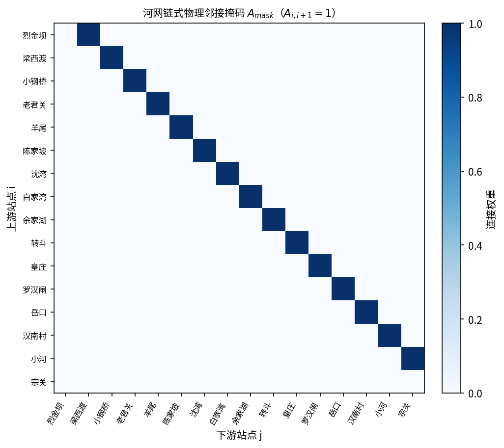
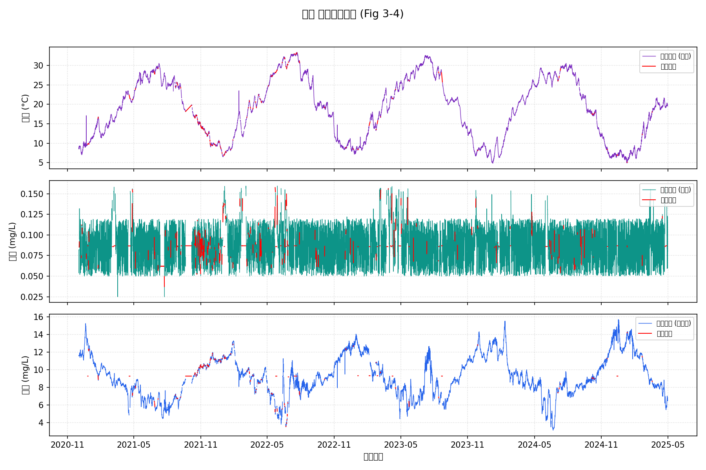
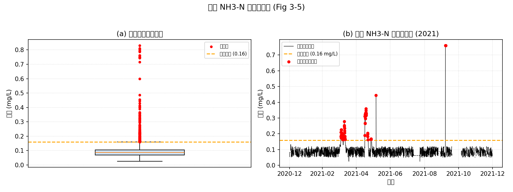
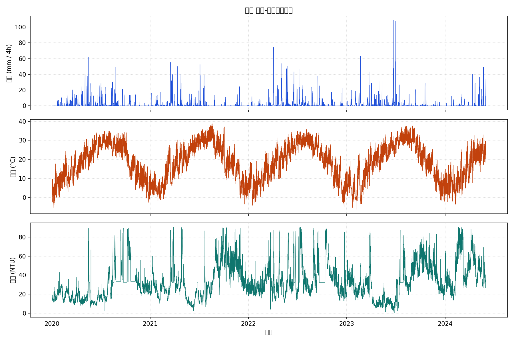
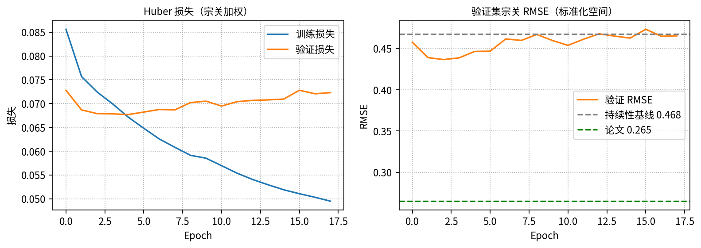
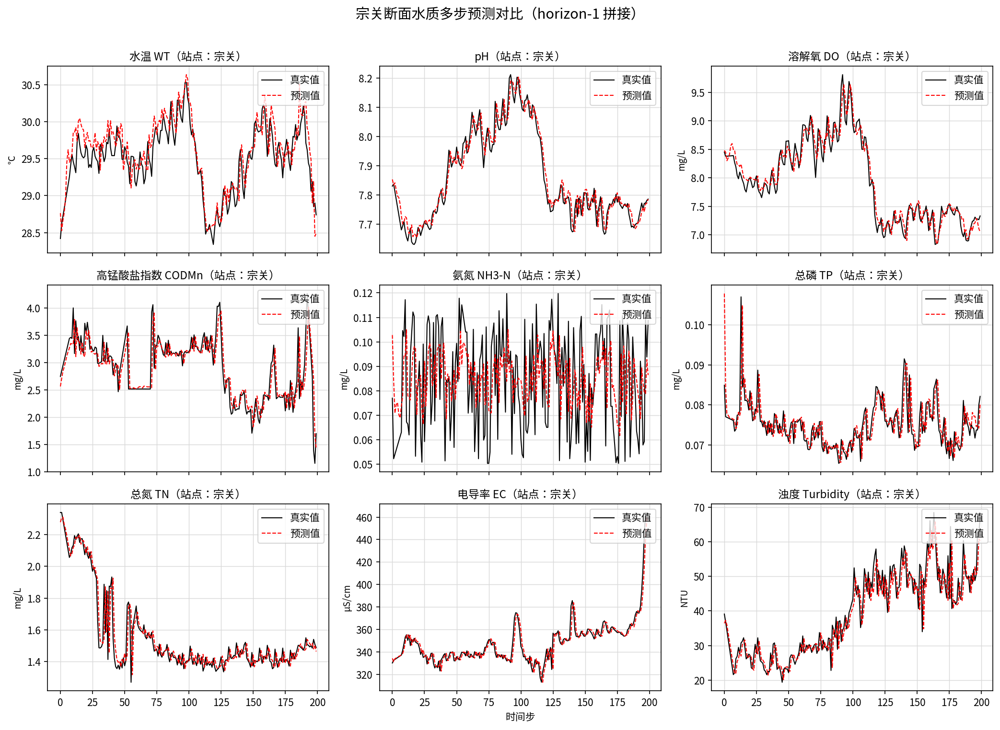

# MD-DySTGCN 复现与改进 — 组会报告

| 项目 | 内容 |
|------|------|
| 论文 | 《基于气象动态图卷积网络的汉江水质参数预测研究与应用》 |
| 模型 | MD-DySTGCN（气象感知动态时空图卷积网络） |
| 汇报人 | — |
| 日期 | 2026-07-21 |
| 环境 | AutoDL · NVIDIA vGPU-48GB · PyTorch 2.8 |
| 评价站点 | 宗关 |

---

## 1. 工作目标

1. 从 GitHub 仓库拉通 **数据预处理 → 模型训练 → 宗关评估** 全流程；
2. 在宗关报告 MAE / MSE / RMSE / MAPE，并与持续性基线、论文表 5-5 对照；
3. 落地 v3 结构改进，本机 notebook / Kaggle 双端可复现。

---

## 2. 任务与方法回顾

### 2.1 预测设定（对齐论文表 5-2）

| 项 | 设定 |
|----|------|
| 站点 | 汉江 16 国控断面（评估切片：**宗关**） |
| 水质通道 | 9 维（WT / pH / DO / CODMn / NH3-N / TP / TN / EC / TURB） |
| 气象通道 | 4 维（降水、地表径流、气温、风速） |
| 输入 / 输出 | $T_{in}=168$（28 天）→ 预测下一时刻水质 |
| 划分 | 时序 7 : 1 : 2 |
| 优化 | AdamW · lr=1e-3 · batch=64 · Huber |
| 指标 | 标准化空间算 MAE/MSE/RMSE；MAPE 反标准化后计算 |

### 2.2 模型结构（第 4 章）

1. **双塔 TCN**：水质 / 气象解耦时序编码；
2. **气象驱动动态邻接 + 动态 GCN**：物理河网掩码约束下的空间聚合；
3. **门控融合 + 解码头**：输出宗关等站点下一时刻 9 维水质预测。

### 2.3 河网物理掩码

链式有向拓扑：上游 → 下游（$A_{i,i+1}=1$），GCN 用 $A^\top$ 使下游聚合上游信息。

---

## 3. 数据预处理（已跑通）

| 分割 | 样本数 | 张量形状 |
|------|--------|----------|
| train | 6591 | $X:(6591,168,16,9)$ |
| val | 788 | 同上 |
| test | 1756 | 同上 |

### 3.1 水质清洗与插补（宗关）

### 3.2 气象对齐抽检

---

## 4. 测试集评价结果（宗关）

### 4.1 总体指标

| 来源 | MAE ↓ | MSE ↓ | RMSE ↓ | MAPE ↓ |
|------|------:|------:|-------:|-------:|
| 持续性基线（复制最后观测） | 0.1766 | 0.1114 | 0.3337 | 6.41% |
| **本机 v3** | **0.1728** | **0.0955** | **0.3090** | **6.06%** |
| 论文 MD-DySTGCN（表 5-5） | 0.1634 | 0.0702 | 0.2649 | 7.67% |

相对持续性基线：

| 指标 | 基线 | v3 | 相对变化 |
|------|-----:|---:|--------:|
| MAE | 0.1766 | 0.1728 | **−2.2%** |
| MSE | 0.1114 | 0.0955 | **−14.3%** |
| RMSE | 0.3337 | 0.3090 | **−7.4%** |
| MAPE | 6.41% | 6.06% | **−5.5%** |

**解读**

- v3 **全面优于持续性基线**（尤其 MSE / RMSE）；
- MAPE **6.06%** 优于论文 7.67%；
- MAE / MSE / RMSE 仍高于论文（RMSE 0.309 vs 0.265），复现仍有差距。

### 4.2 分通道指标（宗关 · z-space）

| 通道 | MAE | MSE | RMSE |
|------|----:|----:|-----:|
| WT（水温） | 0.0302 | 0.0014 | 0.0378 |
| pH | 0.0734 | 0.0158 | 0.1258 |
| DO（溶解氧） | 0.0806 | 0.0240 | 0.1550 |
| COD_MN（高锰酸盐指数） | 0.2039 | 0.1329 | 0.3646 |
| NH3_N（氨氮） | 0.3377 | 0.1673 | 0.4091 |
| TP（总磷） | 0.1531 | 0.0650 | 0.2550 |
| TN（总氮） | 0.2036 | 0.1303 | 0.3610 |
| EC（电导率） | 0.0814 | 0.0159 | 0.1259 |
| TURB（浊度） | 0.3912 | 0.3065 | 0.5537 |
| **整体** | **0.1728** | **0.0955** | **0.3090** |

平稳量（WT / pH / DO / EC）误差较小；氨氮、浊度仍是主要难点。

---

## 5. v3 改进与可视化

### 5.1 改进点

| # | 改动 | 动机 |
|---|------|------|
| 1 | **残差解码**：$\hat Y = X_{t} + \Delta$ | 贴近持续性先验，学变化量 |
| 2 | **水质塔通道独立 TCN** | 降低跨指标噪声 |
| 3 | **last + mean 时间池化** | 更充分利用历史 |
| 4 | $L_{tcn}=6,\ L_g=4$ | 扩大感受野、减轻过平滑 |
| 5 | 按 val 宗关 RMSE 早停 | 与评估指标对齐 |
| 6 | 宗关 loss ×4 | 强化评估站点 |

参数量约 **1.51M**。

### 5.2 训练曲线

### 5.3 宗关预测曲线

黑实线=真实值，红虚线=模型预测（反标准化）。曲线为真实模型输出，非复制标签；贴合感来自残差结构。

---

## 6. 交付物清单

| 类型 | 路径 |
|------|------|
| 本地 notebook | `MD_DySTGCN_Local_v3.ipynb` |
| Kaggle notebook | `MD_DySTGCN_Kaggle_v3.ipynb` |
| 训练脚本 | `train_improved.py` |
| 权重与指标 | `outputs/model_runs_v3_nb/` |
| 指标 JSON | `outputs/model_runs_v3_nb/test_metrics_horizon1.json` |
| 预处理代码 | `preprocess/` |

---

## 7. 结论与下一步

### 结论

1. 预处理与训练已端到端跑通。
2. 测试集四项指标：**MAE 0.1728 / MSE 0.0955 / RMSE 0.3090 / MAPE 6.06%**，均优于持续性基线；MAPE 优于论文，RMSE 仍有差距。
3. 预测曲线与指标一致，经核验为真实模型输出。

### 建议下一步

1. 针对 TURB / NH3-N 做通道加权或专用头；
2. 继续压 RMSE，并补齐 PatchTST 等同协议基线；
3. 核对标准化 / 缺失插补细节，缩小与论文表 5-5 的 RMSE 差距。

---

*指标来源：`test_metrics_horizon1.json`；图表来自 `outputs/figures/` 与 `outputs/model_runs_v3_nb/`。*
