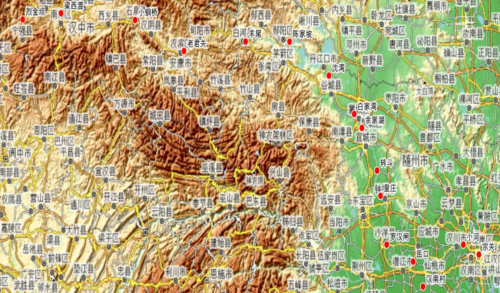
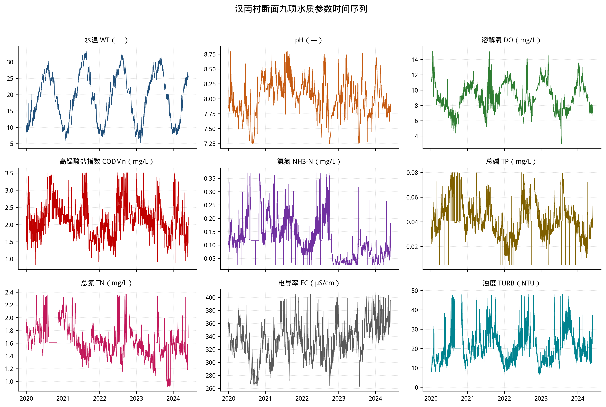
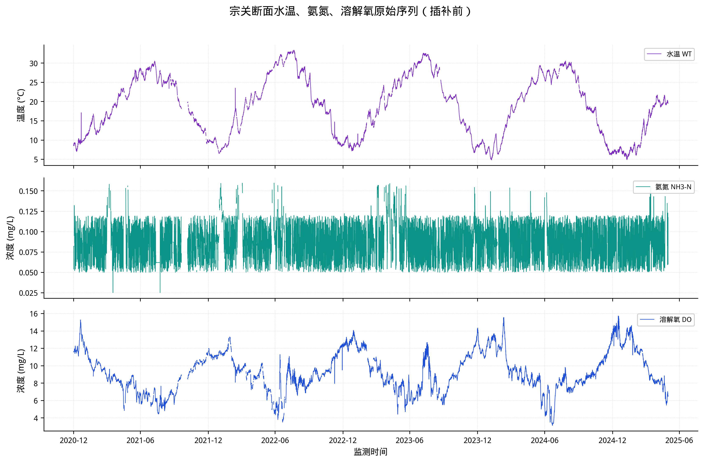
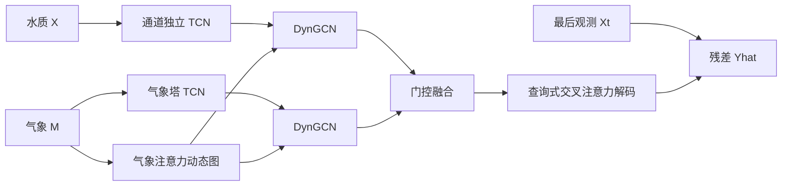
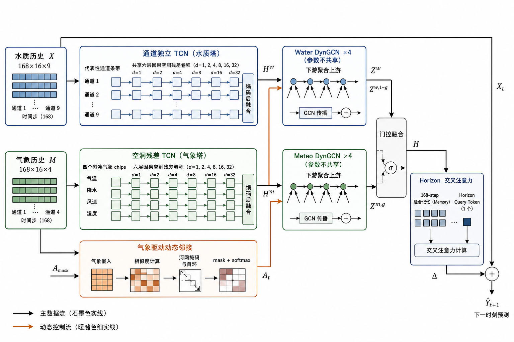
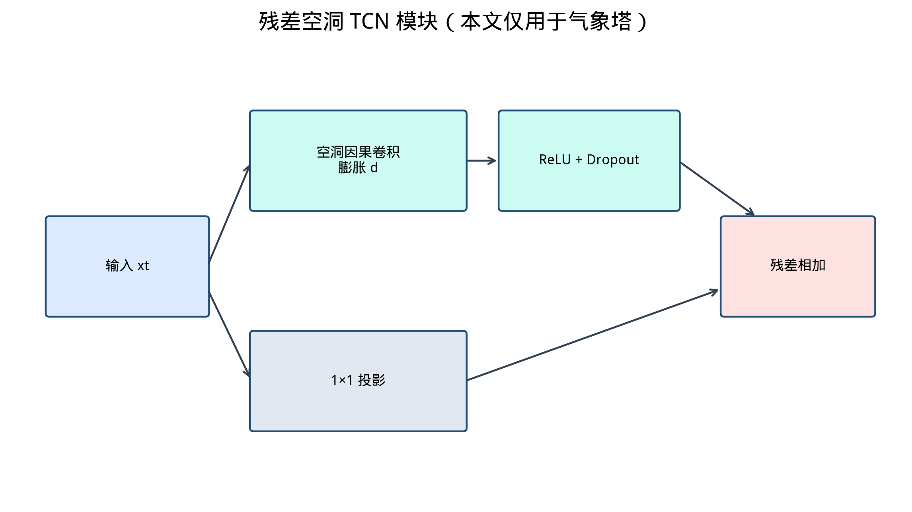
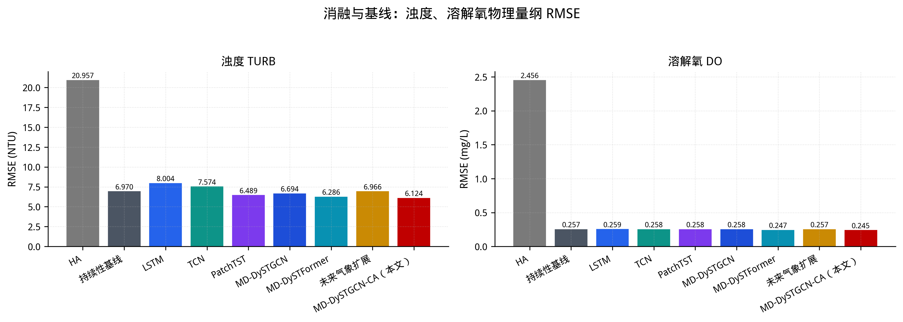
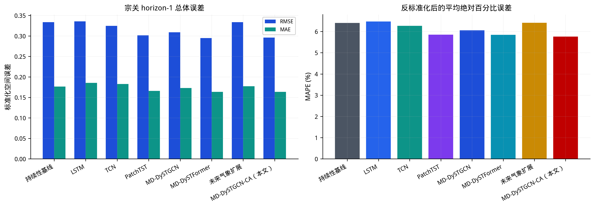
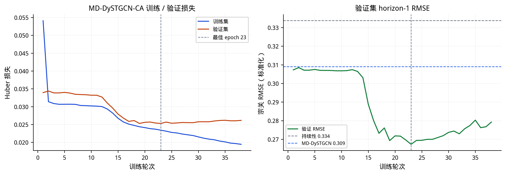

# 气象感知动态图与 TCN 交叉注意力融合的汉江水质参数短时预测

**研究生姓名：** 【作者】

**校内导师姓名、职称：** 【导师】

**申请者类型：** 【申请者类型】

**申请者学习方式：** 全日制

**学科门类：** 工学

**专业名称：** 【专业名称】

**研究方向：** 【研究方向】

**入学时间：** 【入学时间】

**【学校】**

**【答辩年月】**

---

## Short-Term Hanjiang River Water-Quality Parameter Prediction Using Meteorology-Aware Dynamic Graphs and TCN Cross-Attention

**By 【Author】**

**【Year-Month】**

---

## 学位论文独创性声明和使用授权声明

### 学位论文独创性声明

本人所呈交的学位论文，是在导师的指导下，独立进行研究所取得的成果。除文中已经注明引用的内容外，本论文不含任何其他个人或集体已经发表或撰写的作品。对本文的研究做出重要贡献的个人和集体，均已在文中标明。

本声明的法律后果由本人承担。

论文作者（签名）：

年 月 日

### 学位论文使用授权书

本论文作者完全了解学校关于保存、使用学位论文的管理办法及规定，即学校有权保留并向国家有关部门或机构送交论文的复印件和电子版，允许论文被查阅和借阅。本人授权【学校】将本学位论文的全部或部分内容编入有关数据库，也可以采用影印、缩印或扫描等复制手段保存或汇编本学位论文。

注：保密学位论文，在解密后适用于本授权书。

论文作者（签名）：

年 月 日

---

## 摘要

流域水质短时变化受水文、气象和人类活动共同影响，具有时间非平稳性、指标异质性和沿河网传播等特征。汉江兼具重要供水与水环境保障功能，利用多站点历史信息提高多指标短时预测精度具有现实意义。现有方法通常采用独立站点序列或固定空间拓扑，难以表示气象条件变化下的站点关联；不同水质指标的量纲和波动特征差异较大，跨通道信息交互方式也需要审慎设计。

针对上述问题，本文融合国家地表水自动监测数据与 ERA5-Land 再分析数据，构建气象感知动态时空图卷积–交叉注意力网络（Meteorology-aware Dynamic Spatio-Temporal Graph Convolutional Network with Cross-Attention，**MD-DySTGCN-CA**）。模型在河网掩码内利用气象特征调制动态邻接权重，以通道独立时间卷积网络编码水质历史，以空洞时间卷积网络编码气象历史，并通过动态图卷积、门控融合和查询式交叉注意力解码器预测下一观测时刻的九项水质指标。通道独立仅限于水质时间编码阶段，编码结果随后进行通道融合。

数据集包含 16 个汉江干流断面、9 项水质指标和 4 类气象变量，并统一至 4 小时网格。模型以过去 168 步观测预测未来 4 小时水质，数据按时间顺序以 7∶1∶2 划分，Z-score 参数仅由训练集估计。模型输出覆盖 16 个断面，但总体指标仅在宗关断面计算。

宗关测试集上，MD-DySTGCN-CA 取得标准化空间 MAE **0.1635**、RMSE **0.2959** 和物理量纲 MAPE **5.77%**，RMSE 较持续性基线和同协议 MD-DySTGCN 分别降低 **11.33%** 和 **4.24%**。阶段性对照中，查询式交叉注意力替换使 RMSE 由 0.3090 降至 0.2959，MAE 与 MAPE 同步下降；将水质塔替换为分片 Transformer 后 RMSE 仅再降 0.0009，且 MAE 和 MAPE 未同步改善。下一时刻 ERA5-Land 再分析变量未在当前配置下带来增益。由于评价限于宗关断面和单次随机种子，且异常处理与插补发生在时间划分之前，相关性能结论仍需通过无泄漏预处理、多随机种子和多站点评价进一步验证。

**关键词：** 流域水质预测；动态图卷积；时间卷积网络；交叉注意力；气象驱动；汉江

---

## Abstract

Short-term river-basin water quality is jointly affected by hydrological, meteorological and anthropogenic processes, resulting in temporal non-stationarity, indicator heterogeneity and river-network-dependent transport. For the Hanjiang River, exploiting multi-station histories may improve short-term multi-indicator prediction. Existing approaches commonly treat stations independently or assume a fixed spatial topology, while the appropriate interaction between water-quality channels remains uncertain because their scales and variability differ substantially.

This study integrates national automatic water-quality monitoring records with ERA5-Land reanalysis data and develops a **Meteorology-aware Dynamic Spatio-Temporal Graph Convolutional Network with Cross-Attention (MD-DySTGCN-CA)**. Meteorological features modulate dynamic adjacency weights within a physical river-network mask. A channel-independent temporal convolutional network encodes water-quality histories, a dilated temporal convolutional network encodes meteorological histories, and graph convolution, gated fusion and a query-based cross-attention decoder predict nine water-quality indicators at the next observation time. Channel independence applies only during water-quality temporal encoding; the encoded channels are subsequently fused.

The dataset comprises 16 main-stem stations, nine water-quality indicators and four meteorological variables on a 4-hour grid. The model uses 168 historical steps to predict water quality four hours ahead. Data are split chronologically at a 7:1:2 ratio, and Z-score parameters are estimated from the training period only. Although predictions are generated for all 16 stations, aggregate evaluation is reported only for Zongguan.

At Zongguan, MD-DySTGCN-CA achieves a standardized-space MAE of **0.1635** and RMSE of **0.2959**, together with a physical-scale MAPE of **5.77%**. Its RMSE is **11.33%** lower than persistence and **4.24%** lower than the protocol-matched MD-DySTGCN. Replacing pooled decoding with query-based cross-attention reduces RMSE from 0.3090 to 0.2959 and simultaneously improves MAE and MAPE, whereas replacing the water-quality tower with a patch Transformer provides only a further 0.0009 RMSE reduction and does not simultaneously improve MAE and MAPE. Adding next-step ERA5-Land reanalysis variables provides no gain under the tested configuration. These findings remain limited by single-station reporting, one random seed and preprocessing in which outlier handling and imputation precede the temporal split.

**Key Words:** river-basin water quality prediction; dynamic graph convolution; temporal convolutional network; cross-attention; meteorological forcing; Hanjiang River

---

## 目录

- [第1章 绪论](#第1章-绪论)
  - [1.1 研究背景与意义](#11-研究背景与意义)
  - [1.2 国内外研究现状](#12-国内外研究现状)
  - [1.3 研究内容、创新点与技术路线](#13-研究内容创新点与技术路线)
- [第2章 相关理论](#第2章-相关理论)
  - [2.1 水质系统演变机理](#21-水质系统演变机理)
  - [2.2 时间序列预测模型](#22-时间序列预测模型)
  - [2.3 图神经网络与空间建模](#23-图神经网络与空间建模)
  - [2.4 模型评价指标](#24-模型评价指标)
- [第3章 数据集构建与预处理](#第3章-数据集构建与预处理)
  - [3.1 研究区域与多源数据概况](#31-研究区域与多源数据概况)
  - [3.2 水质数据预处理](#32-水质数据预处理)
  - [3.3 气象数据时空对齐](#33-气象数据时空对齐)
  - [3.4 河网掩码、划分、标准化与滑窗](#34-河网掩码划分标准化与滑窗)
- [第4章 气象感知动态时空图卷积–交叉注意力网络](#第4章-气象感知动态时空图卷积交叉注意力网络)
  - [4.1 问题形式化与总体架构](#41-问题形式化与总体架构)
  - [4.2 通道独立TCN水质塔](#42-通道独立tcn水质塔)
  - [4.3 空洞TCN气象塔](#43-空洞tcn气象塔)
  - [4.4 气象驱动动态邻接](#44-气象驱动动态邻接)
  - [4.5 动态图卷积与门控融合](#45-动态图卷积与门控融合)
  - [4.6 查询式交叉注意力解码与残差预测](#46-查询式交叉注意力解码与残差预测)
- [第5章 实验与结果分析](#第5章-实验与结果分析)
  - [5.1 实验设置与对比协议](#51-实验设置与对比协议)
  - [5.2 总体预测性能](#52-总体预测性能)
  - [5.3 分通道误差分析](#53-分通道误差分析)
  - [5.4 消融实验](#54-消融实验)
  - [5.5 训练过程与预测可视化](#55-训练过程与预测可视化)
- [第6章 总结与展望](#第6章-总结与展望)
  - [6.1 研究总结](#61-研究总结)
  - [6.2 研究展望](#62-研究展望)
- [参考文献](#参考文献)

---

## 第1章 绪论

### 1.1 研究背景与意义

#### 1.1.1 研究背景

流域水质是水文循环、生物地球化学过程与人类活动共同作用的结果。监测序列既包含水温、电导率等指标的季节变化，也包含降雨冲刷引起的浊度和营养盐脉冲；上下游断面还可能因水体输移、支流汇入和库区调度形成具有方向性和时滞性的关联[32]。因此，汉江水质短时预测需要同时处理多站点、多指标和气象外生变量。

水质自动监测站能够以数小时为间隔持续记录多项指标，ERA5-Land 则提供空间连续的降水、地表径流、气温和风速信息[31]。固定邻接矩阵可以表达河网连接，却不能显式表示不同降雨—径流情景下可能变化的站点关联强度；气象调制的动态邻接为描述这种变化提供了一种建模方式。本文尚未设置静态邻接消融实验，因此动态边权的独立贡献仍有待验证。

多变量时序模型还需处理不同水质指标之间显著的量纲和波动差异。时间卷积网络适合编码具有局部脉冲和多尺度滞后的序列[11]，PatchTST 则在注意力编码阶段保持通道独立[13]。基于本文数据特征，本文选择在水质时间编码阶段保持通道独立，并在编码后进行通道融合；该选择是一项待由对照实验检验的架构先验，而不是已经得到验证的噪声抑制机制。

#### 1.1.2 研究意义

（1）理论与方法意义。本文将河网约束下的气象驱动动态邻接、通道独立时间卷积编码和查询式交叉注意力解码纳入统一模型，为多站点水质与气象序列的联合建模提供一种结构化方案。该方案区分空间信息传播、单通道时序编码和解码阶段的历史聚合，但现有实验只能直接支持整体模型及解码器替换在当前协议下的表现。

（2）实践意义。本文以汉江 16 个干流断面构建空间图，并以宗关断面的下一 4 小时九指标预测作为评价案例，给出统一数据划分和评价口径下的实验基准。该结果可为后续多站点短时预测研究提供参照，但尚不足以支持业务预警或跨断面泛化结论。

### 1.2 国内外研究现状

#### 1.2.1 机理模型与统计学习

机理模型以质量守恒、水动力和物质迁移转化方程描述水环境过程，适用于过程解释和情景分析。SWAT 常用于流域径流与非点源模拟[3-4]，国内研究也将 SWAT、MIKE11 和 WASP 用于汉江相关水资源或水环境问题[1-2,28]。这类模型具有明确的物理基础，但其参数率定、边界条件和计算需求限制了其在高频多站点滚动预测中的直接应用。

随着监测数据积累，人工神经网络、支持向量机和随机森林等方法被用于水资源变量和水质指标预测[5-6,22-25]。此类方法能够拟合非线性关系，但传统应用多以单站点或单指标为对象，长时间依赖、河网方向性和气象外生驱动通常未在同一框架内同时处理。

#### 1.2.2 深度学习时序模型

LSTM 和 GRU 通过门控状态缓解普通循环网络的长程梯度问题，并已用于水质预测[7-8]。时间卷积网络（TCN）利用因果卷积、空洞卷积和残差连接并行扩大时间感受野[11,29]，适合编码具有局部脉冲和多尺度滞后的气象序列。

Transformer 通过自注意力建模序列位置之间的依赖[12]。PatchTST 将一元序列划分为片段并在注意力编码阶段保持通道独立[13]，Crossformer 则显式建模跨维依赖[14]。现有方法表明卷积、分片和跨维建模均可用于多变量预测，但哪种时间编码更适合量纲与波动差异较大的水质指标，仍取决于具体数据和对照实验。本文主模型据此采用通道独立 TCN 编码、编码后融合的水质塔，并将分片 Transformer 作为同协议水质塔对照。

#### 1.2.3 时空图网络与多源融合

图神经网络可将监测断面表示为图 \(G=(V,E,A)\)，并沿给定连接聚合节点信息[15-16]。STGCN、Graph WaveNet 和 MTGNN 等模型表明，显式或自适应图结构有助于时空预测[17-19]。对于河流水质，空间传播应受到河网方向约束，而边权又可能随气象条件变化。基于保留水文先验的建模思想[21,26]，本文仅在河网掩码允许的连接内利用气象特征调制边权。

本文以项目既有的 MD-DySTGCN 复现模型为同协议参照框架，在保留气象动态邻接、双路图卷积、门控融合和通道独立 TCN 水质编码的基础上，重点考察查询式交叉注意力能否比末时刻—均值池化更有效地利用 168 步历史，并以分片 Transformer 水质塔作为后续结构对照。所有对比采用相同预处理和单步预测协议，以减少预测步长和实现差异造成的混淆。

### 1.3 研究内容、创新点与技术路线

#### 1.3.1 研究内容

（1）**多源数据构建。** 对 16 个汉江干流断面的水质监测数据进行时间对齐、异常处理和缺失值插补，并将 ERA5-Land 气象变量插值至各断面；随后构建河网掩码，按时间划分训练集、验证集和测试集，形成水质—气象双流滑窗样本。

（2）**MD-DySTGCN-CA 建模。** 在河网掩码内根据气象特征生成动态邻接权重，以通道独立时间卷积网络和空洞时间卷积网络分别编码水质与气象历史，经双路动态图卷积和门控融合后，由查询式交叉注意力解码器完成残差预测。

（3）**单步预测实验。** 在宗关断面开展下一 4 小时九指标预测，对比持续性基线、单站点时序模型、MD-DySTGCN 及结构变体，并以 MAE、RMSE 和 MAPE 评价总体及分通道误差；同时报告单随机种子、单站评价和预处理潜在信息泄漏等边界。

#### 1.3.2 创新点

1. **查询式交叉注意力解码。** 以单步查询对 168 步融合历史进行选择性聚合，替代末时刻—均值池化。当前同协议对照中，该替换使 RMSE 由 0.3090 降至 0.2959，MAE 与 MAPE 同步下降，是现有实验中证据最直接的结构改进。
2. **通道独立 TCN 水质编码。** 在气象动态图框架中保持各水质指标在时间卷积编码阶段相互独立，并在编码后完成通道融合。该设计用于控制跨通道交互发生的位置；将其替换为分片 Transformer 后总体指标未一致改善，因此独立增益仍需重复实验验证。
3. **受河网约束的水质—气象联合框架。** 将气象调制的动态邻接、双路图卷积、门控融合、通道独立时间卷积编码和残差预测统一于单步任务。由于尚未分别移除动态图和门控模块，现有结果只支持整体框架表现，不能归因于这些模块的独立作用。

#### 1.3.3 技术路线

本文技术路线包括三个阶段：首先完成水质与 ERA5-Land 数据清洗、时空对齐、河网构建和滑窗样本生成；其次构建并训练 MD-DySTGCN-CA，实现水质—气象双流编码、动态图传播、门控融合和单步解码；最后在统一数据划分与评价口径下开展基线比较、结构对照和误差分析。总体路线如图 1-1 所示。

**图1-1 研究技术路线。** 包括多源数据构建、时空预测模型建立和实验评价三个阶段。

---

## 第2章 相关理论

### 2.1 水质系统演变机理

#### 2.1.1 多变量耦合

九项常规水质指标通过物理、化学和生物过程相互关联。水温影响气体溶解度与反应速率，pH 影响氨氮形态，有机物降解消耗溶解氧，氮磷变化还可能通过藻类过程影响浊度与昼夜溶解氧[32]。上述过程说明多指标联合建模具有合理性，但物理耦合并不意味着所有指标都应在时间编码阶段直接混合。本文采用通道独立时间卷积编码、编码后融合的结构，以控制跨通道交互发生的位置；其是否优于跨通道编码仍需专门对照实验验证。

#### 2.1.2 气象驱动路径

降水可通过冲刷和稀释两种方向相反的过程改变水质：降雨初期可能增加悬浮物和营养盐输入，持续降雨又可能降低部分溶解性污染物浓度。气温影响水体热状态、复氧和生物代谢，风速影响水—气交换及浅水区扰动，地表径流则表征降水向河道旁侧入流的转化[32]。由于这些影响具有非线性和时间滞后，仅依赖水质历史可能不足以描述气象事件前后的变化，因此本文将气象变量作为外生输入。

**图2-1 气象驱动下的水质多变量耦合演变机理框架。**

#### 2.1.3 大气再分析

ERA5 通过资料同化融合观测与数值模式[20]；ERA5-Land 则以 ERA5 气象场为强迫，在更高空间分辨率上重放陆面模式，其本身不进行独立资料同化[31]。本文使用与水质网格对齐的 4 小时 ERA5-Land 场：降水与地表径流由米转换为毫米，2 m 气温由开尔文转换为摄氏度，10 m 风速由 \(u,v\) 分量合成。再分析数据不等同于业务气象预报；下一时刻 ERA5-Land 变量仅用于结构对照，其负向结果不能据此归因于残差解码冲突。

### 2.2 时间序列预测模型

#### 2.2.1 循环网络（简述）

RNN 以 \(h_t=\sigma(W_{hx}x_t+W_{hh}h_{t-1}+b_h)\) 传递状态，长序列上易梯度消失。LSTM 用遗忘门与输入门缓解该问题，但计算串行，对 168 步窗口不够经济，也缺乏对局部脉冲的卷积归纳偏置。本文不将 LSTM 作为主编码器，仅作为相关工作对照。

#### 2.2.2 时间卷积网络

因果卷积保证 \(y_t\) 只依赖 \(t\) 及以前：

$$
y_t=\sum_{k=0}^{K-1} f_k\, x_{t-k} \tag{2-1}
$$

空洞卷积以膨胀 \(d\) 扩大感受野：

$$
(x *_d f)(s)=\sum_{i=0}^{K-1} f_i\, x_{s-d\cdot i} \tag{2-2}
$$

残差块 \(o=\mathrm{ReLU}(x+\mathcal{F}(x))\) 稳定深层训练。本文水质塔与气象塔均堆叠 6 个残差块，每块含两层核宽为 3 的因果卷积，膨胀率依次为 \(2^{0}\sim 2^{5}\)。其理论感受野为 \(1+2(K-1)\sum_{\ell=0}^{5}2^\ell=253\) 步，受输入长度限制时覆盖完整的 168 步历史窗口。水质塔对每个通道独立执行该卷积，气象塔则对 4 个气象变量联合卷积。

#### 2.2.3 通道独立分片 Transformer

PatchTST 将长度为 \(T\) 的一元序列分为 \(P=T/P_{\ell}\) 个长度为 \(P_{\ell}\) 的片段，线性嵌入后加位置编码，再送入 Transformer 编码器。各通道在注意力编码阶段独立处理，编码结果随后拼接并通过 MLP 融合。对水质而言，每个 patch 对应 \(8\times 4=32\) 小时，自注意力在 patch 级建模中程依赖，计算量由 \(O(T^2)\) 降为 \(O(P^2)\)。本文在结构对照中取 \(T=168\)、\(P_{\ell}=8\)，故 \(P=21\)；编码后在时间维线性插值回 168 步，以便与气象塔及逐步动态图对齐。该编码器仅用于水质塔消融，不属于最终模型。

#### 2.2.4 交叉注意力

解码器查询 \(Q\) 对记忆 \(K,V\) 做

$$
\mathrm{Attn}(Q,K,V)=\mathrm{softmax}_{L_k}\!\left(\frac{QK^\top}{\sqrt{d_k}}\right)V \tag{2-3}
$$

其中 \(Q\in\mathbb{R}^{L_q\times d_k}\)、\(K\in\mathbb{R}^{L_k\times d_k}\)、\(V\in\mathbb{R}^{L_k\times d_v}\)，softmax 沿 \(L_k\) 个历史位置计算。单步预测时 \(L_q=1\)，\(K,V\) 来自 168 步融合特征；查询机制因而能够对历史位置分配非均匀权重，而不是对整段历史做均匀池化。

### 2.3 图神经网络与空间建模

图 \(G=(V,E,A)\)，\(|V|=N=16\)。有向边表示上游对下游的水力联系。谱域 GCN 的一阶近似为

$$
H^{(l+1)}=\sigma\!\left(\tilde{D}^{-1/2}\tilde{A}\tilde{D}^{-1/2} H^{(l)} W^{(l)}\right) \tag{2-4}
$$

其中 \(\tilde{A}=A+I\)。在实现中，动态邻接先按行 softmax，传播时使用 \(A^\top\) 使下游聚合上游，再做对称归一化。河网掩码 \(A_{\mathrm{mask}}\) 把非邻接位置的 logits 置为很大的负数，softmax 后近似为零，从而禁止“跳站”或反向边。注意力式构图（节点气象嵌入点积）使边权随时间变化，这与静态 GCN 的本质区别。

### 2.4 模型评价指标

主指标在**标准化空间**、**宗关断面**、**全部 9 通道展平**上计算，避免电导率量纲淹没总磷。MAPE 在反标准化后的物理量纲上计算，分母取 \(\max(|y|,10^{-3})\) 以避免近零除。

$$
\mathrm{MAE}=\frac{1}{N_{\mathrm{eval}}}\sum_{i=1}^{N_{\mathrm{eval}}}\lvert \hat y_i-y_i\rvert,\quad
\mathrm{RMSE}=\sqrt{\frac{1}{N_{\mathrm{eval}}}\sum_{i=1}^{N_{\mathrm{eval}}}(\hat y_i-y_i)^2} \tag{2-5}
$$

$$
\mathrm{MAPE}=\frac{100}{N_{\mathrm{eval}}}\sum_{i=1}^{N_{\mathrm{eval}}}
\frac{\lvert \hat y_i^{\mathrm{phys}}-y_i^{\mathrm{phys}}\rvert}{\max(\lvert y_i^{\mathrm{phys}}\rvert,10^{-3})} \tag{2-6}
$$

其中 \(N_{\mathrm{eval}}\) 为测试窗口数与九个水质通道数的乘积。持续性基线将输入窗口最后一个观测时刻的水质复制为下一时刻预测，是单步任务中的强基线；模型只有稳定低于该基线，才表明其学到了有效的增量 \(\Delta\)。

---

## 第3章 数据集构建与预处理

本章说明研究区域、多源数据、质量控制、缺失值处理、气象对齐、河网构建和滑窗样本生成过程。所有数据处理步骤均按实际实现记录；其中可能影响评价边界的处理顺序单独披露。

### 3.1 研究区域与多源数据概况

#### 3.1.1 研究区域与监测断面

汉江发源于秦岭南麓并于武汉汇入长江，流域由上游山区、中游库区和下游平原构成[1]。本文从现有自动监测数据中选取 16 个干流断面，并按上游至下游顺序构成图节点。表 3-1 给出断面名称与经纬度，图 3-1 展示流域地理背景。

**图3-1 汉江流域地理位置及地形分布图。**

**表3-1 水质监测站点（上游→下游）**

| 断面 | 经度 | 纬度 | 城市 |
|------|------|------|------|
| 烈金坝 | 106.2589 | 33.0438 | 汉中市 |
| 梁西渡 | 106.9289 | 33.1074 | 汉中市 |
| 小钢桥 | 108.2210 | 33.0361 | 安康市 |
| 老君关 | 109.0742 | 32.7156 | 安康市 |
| 羊尾 | 110.1478 | 32.8153 | 十堰市 |
| 陈家坡 | 110.9144 | 32.8139 | 十堰市 |
| 沈湾 | 111.6000 | 32.4600 | 襄阳市 |
| 白家湾 | 112.0409 | 32.0584 | 襄阳市 |
| 余家湖 | 112.1764 | 31.9142 | 襄阳市 |
| 转斗 | 112.4403 | 31.4661 | 荆门市 |
| 皇庄 | 112.5683 | 31.1964 | 荆门市 |
| 罗汉闸 | 112.6081 | 30.6823 | 荆门市 |
| 岳口 | 113.0694 | 30.5017 | 天门市 |
| 汉南村 | 113.2414 | 30.2351 | 仙桃市 |
| 小河 | 113.9455 | 30.6806 | 孝感市 |
| 宗关 | 114.2177 | 30.5773 | 武汉市 |

模型同时预测全部 16 个断面。本文根据数据完整性和研究设计将宗关选为唯一总体指标报告站点，因此后续结论仅代表该断面的评价结果，不外推为整个汉江流域的空间泛化性能。

#### 3.1.2 水质参数

水质原始数据包含断面名称、监测时间和多项水质指标。本文仅保留表 3-1 所列 16 个断面及九项建模指标，同一时刻的重复记录取均值，再对齐至 2021-01-01 00:00 至 2025-05-31 20:00 的完整 4 小时网格。距最近网格点超过 1 小时的记录不参与对齐，最终得到 \(\mathbf X^{\mathrm{raw}}\in\mathbb R^{T_{\mathrm{all}}\times16\times9}\)，其中 \(T_{\mathrm{all}}=9672\)。

**表3-2 水质通道说明**

| 参数 | 符号 | 单位 | 含义 |
|------|------|------|------|
| 水温 | WT | ℃ | 热状态，影响溶解氧与反应速率 |
| pH | pH | — | 酸碱度 |
| 溶解氧 | DO | mg/L | 自净与生态健康 |
| 高锰酸盐指数 | COD-Mn | mg/L | 可氧化有机物 |
| 氨氮 | NH3-N | mg/L | 生活污水与农业径流 |
| 总磷 | TP | mg/L | 富营养化限制因子 |
| 总氮 | TN | mg/L | 氮总量 |
| 电导率 | EC | μS/cm | 溶解性离子 |
| 浊度 | TURB | NTU | 悬浮物，强降雨敏感 |

图 3-2 展示汉南村九项水质指标在研究期内的变化，用于比较不同通道的量纲、波动幅度和季节结构。

**图3-2 汉南村站点九项水质参数时间序列。**

#### 3.1.3 气象驱动变量

气象数据采用 ERA5-Land 月尺度文件[31]，选取总降水量、地表径流、2 m 气温和 10 m 风速四个变量。格点场经双线性插值映射至 16 个断面经纬度，再与水质时间戳对齐，形成 \(\mathbf M\in\mathbb R^{T_{\mathrm{all}}\times16\times4}\)。

**表3-3 ERA5-Land 驱动变量**

| 变量 | 特征名 | 单位 | 作用 |
|------|--------|------|------|
| 总降水量 | precipitation | mm | 冲刷与稀释的直接触发 |
| 地表径流 | surface_runoff | mm | 陆面汇流对浓度的调制 |
| 2 m 气温 | air_temp_2m | ℃ | 热力与生物过程 |
| 10 m 风速 | wind_speed_10m | m/s | 复氧与扰动 |

### 3.2 水质数据预处理

水质数据依次经过预设质量控制、箱线异常识别和分层插补。各步骤按站点、按水质通道执行。

#### 3.2.1 预设质量控制范围

超出预设质量控制范围的观测被置为 NaN。具体范围为：WT \([-5,45]\) ℃，pH \([0,14]\)，DO \([0,20]\) mg/L，COD-Mn \([0,50]\) mg/L，NH3-N \([0,20]\) mg/L，TP \([0,5]\) mg/L，TN \([0,30]\) mg/L，EC \([1,5000]\) μS/cm，TURB \([0,2000]\) NTU。EC 为 0 时按无效记录处理。这些范围属于本研究的工程质量控制设定，用于减少明显异常记录对后续四分位统计的影响。

#### 3.2.2 箱线异常

对每一站点、每一通道，在有效样本不少于 8 的前提下计算 \(Q_1,Q_3\) 与 \(IQR=Q_3-Q_1\)，\(k=1.5\)：

$$
\mathrm{Lower}=Q_1-1.5\cdot IQR,\quad \mathrm{Upper}=Q_3+1.5\cdot IQR \tag{3-1}
$$

越界点被置为 NaN。箱线规则不要求数据服从正态分布，适用于氨氮等右偏序列；但当前阈值在完整时间段上估计，其信息边界见第 3.2.3 节。

**图3-5 氨氮（NH3-N）箱线异常检测。**

#### 3.2.3 分层差异化插补

WT、pH 和 EC 采用线性插值；序列内部缺口按相邻有效观测插值，首尾缺口沿用最近的有效边界值。当有效观测不足两个时，以该序列有效值均值填充；若无有效值，则实现回退为 0。

NH3-N、TP、TURB、TN、DO 和 COD-Mn 使用长短缺口规则。长度不超过 6 个时间步（24 h）的缺口采用线性插值；长度超过 6 个时间步的缺口先计算缺口前后各最多 42 个时间步内有效观测的均值。若整段序列中与缺口起点具有相同日内时次的位置至少存在 3 个有效观测，则全序列同日内时次均值覆盖局部窗均值。突变型与复合型通道在当前实现中采用相同计算规则，仅保留类别标签上的区别。

当前复现实验先在完整时间序列上估计各站点、各通道的 IQR 阈值并执行插补，随后才划分训练集、验证集和测试集。因此，IQR 阈值、双侧局部窗和全序列同日内时次均值均可能使用验证或测试时段信息；测试标签中的缺测值也可能由跨时段信息合成。仅在训练集拟合 Z-score 不能消除该泄漏。第 5 章结果只能解释为既有预处理流水线下的描述性复现结果，不能视为严格无泄漏的部署性能。严格评估应先按时间划分原始数据，只在训练段拟合异常阈值和统计量；验证、测试输入采用因果插补，并在评价时屏蔽原本缺失的标签。

图 3-3 展示宗关 WT、NH3-N 和 DO 的插补前序列；图 3-4 在观测曲线上叠加插补段，红线表示算法填补结果。

**图3-3 宗关断面水温、氨氮、溶解氧原始序列（插补前）。**

**图3-4 宗关断面插补结果。** 红线为算法填补，其余为原始观测。

### 3.3 气象数据时空对齐

ERA5-Land 月文件经读取后，在统一纬度方向下通过双线性插值映射至 16 个站点经纬度。

单位与时间约定：

- `tp`、`sro`：代码将文件中各时次的数值由米转换为毫米（\(\times 1000\)），不再执行小时值求和或重采样。本地文件时间点为 00/04/08/12/16/20 时，具体累积区间以 ERA5-Land 下载请求和变量元数据为准。
- `t2m`：开尔文 → 摄氏度（\(-273.15\)）。
- 风速：\(\sqrt{u_{10}^2+v_{10}^2}\)。

瞬时量按时刻对齐，格点覆盖率为 100%。图 3-6 给出宗关降水、气温与浊度的对齐抽检。

**图3-6 宗关气象通道与浊度对齐抽检。**

### 3.4 河网掩码、划分、标准化与滑窗

预处理依次完成河网掩码构建、时间划分、标准化和滑窗样本生成。

#### 3.4.1 链式物理掩码

有向链式掩码满足：对 \(i=0,\ldots,14\)，\(A_{\mathrm{mask}}[i,i+1]=1\)，表示上游站点连接至紧邻下游站点。图卷积传播时使用转置矩阵，使下游节点聚合上游信息。图 3-7 展示该掩码。

**图3-7 16 站点链式有向掩码 \(A_{\mathrm{mask}}\)。**

#### 3.4.2 时序划分与 Z-score

完整时间网格按 7∶1∶2 划分且不打乱。\(T_{\mathrm{all}}=9672\) 时，训练、验证和测试段长度分别为 6770、967 和 1935。Z-score 参数仅在训练时间段估计：站点维展平后计算每个通道的 \(\mu\) 和 \(\sigma\)，当标准差小于 \(10^{-8}\) 时回退为 1，再以同一参数变换全部时段。该操作避免了标准化环节直接使用验证集和测试集统计量，但不能抵消此前全时间段异常检测与插补造成的信息泄漏。

#### 3.4.3 滑窗与单步标签

滑窗在各时间段内独立生成，窗口不得跨越划分边界。批量输入水质和气象张量分别为 \(\mathbf X^z\in\mathbb{R}^{B\times168\times16\times9}\) 和 \(\mathbf M^z\in\mathbb{R}^{B\times168\times16\times4}\)，原始存储标签为 \(\mathbf Y^z\in\mathbb{R}^{B\times12\times16\times9}\)。训练、验证和测试样本数分别为 6591、788 和 1756。

训练时仅使用存储标签的第一个时间步，即 \(T_{\mathrm{out}}=1\)，将任务定义为下一 4 小时时刻的九指标预测。未来气象结构对照同样只读取下一时刻的 ERA5-Land 变量。

**表3-4 预处理张量与样本规模**

| 项 | 设定或数值 |
|----|------------|
| 时间网格 | 2021-01-01 00:00 ~ 2025-05-31 20:00，4 h，\(T=9672\) |
| 站点 / 水质通道 / 气象通道 | 16 / 9 / 4 |
| 输入 / 标签窗 | \(T_{\mathrm{in}}=168\)（28 天），npz 中 \(T_{\mathrm{out}}=12\) |
| 训练任务 | 切片为 \(T_{\mathrm{out}}=1\) |
| 划分 | 时序 0.7 / 0.1 / 0.2 |
| 滑窗样本 | 6591 / 788 / 1756 |
| 标准化 | 仅训练集 \(\mu/\sigma\)，站点池化 |

---

## 第4章 气象感知动态时空图卷积–交叉注意力网络

MD-DySTGCN-CA 以过去 168 个 4 小时时步的水质和气象观测为输入，在固定河网连接范围内生成逐时刻动态边权，经水质—气象双流编码、图传播和门控融合后预测下一 4 小时的水质增量。图 4-1 给出总体结构，后续各节依次说明任务定义、水质与气象编码、动态邻接、图卷积、融合与解码过程。

### 4.1 问题形式化与总体架构

记完整时间网格长度为 \(T_{\mathrm{all}}=9672\)，批量大小为 \(B\)，站点数、目标通道数和气象通道数分别为 \(N=16\)、\(C=9\) 和 \(D=4\)。水质与气象数据经训练集统计量标准化后分别记为 \(\mathbf X^z\) 和 \(\mathbf M^z\)。对任一样本，模型接收长度 \(T_{\mathrm{in}}=168\) 的历史窗口，并执行映射

$$
\hat{\mathbf Y}^{z}_{t+1}=f_{\theta}\!\left(\mathbf X^{z}_{t-T_{\mathrm{in}}+1:t},\mathbf M^{z}_{t-T_{\mathrm{in}}+1:t},A_{\mathrm{mask}}\right),\quad
\hat{\mathbf Y}^{z}_{t+1}\in\mathbb R^{N\times C}
$$

模型训练时同时预测 16 个站点的 9 项指标，并通过站点加权损失提高宗关的梯度贡献；第 5 章主指标仅在宗关计算。批量输入的水质张量和气象张量分别为 \(\mathbb R^{B\times T_{\mathrm{in}}\times N\times C}\) 和 \(\mathbb R^{B\times T_{\mathrm{in}}\times N\times D}\)。物理掩码 \(A_{\mathrm{mask}}\in\{0,1\}^{N\times N}\) 固定，动态邻接则对每个样本、每个历史时刻单独生成。

信息流如下：水质历史经通道独立 TCN 得到 \(\mathbf H^w\)，气象历史经 TCN 得到 \(\mathbf H^m\)，同时生成受河网掩码约束的动态邻接 \(A_t\)。两路特征分别经动态图卷积后门控融合为 \(\mathbf H\)；查询式交叉注意力解码器输出增量 \(\Delta\)，再与最后观测相加。隐藏维 \(F=128\)。

**图4-1 MD-DySTGCN-CA 总体结构。** 气象特征同时参与气象历史编码和河网允许边的动态权重生成，水质与气象表示经双路图卷积和门控融合后由查询式交叉注意力完成单步残差预测。

### 4.2 通道独立TCN水质塔

本文采用通道独立时间卷积网络作为水质编码器，使九项水质指标先各自学习时间表示，再在编码后融合。对每个批量样本、站点和水质通道，长度为 \(T_{\mathrm{in}}\) 的一元序列经 6 个残差 TCN 块映射到 \(F=128\) 维，再将 \(C\) 个通道拼接后由两层 MLP 融合：

$$
\mathbf U_{b,n,c}=\operatorname{TCN}_{\mathrm{CI}}(\mathbf X^z_{b,:,n,c})\in\mathbb R^{T_{\mathrm{in}}\times F},\quad
\mathbf H^w_{b,:,n,:}=\Psi([\mathbf U_{b,n,1};\ldots;\mathbf U_{b,n,C}])\in\mathbb R^{T_{\mathrm{in}}\times F} \tag{4-1}
$$

\(\operatorname{TCN}_{\mathrm{CI}}\) 由 6 个残差块组成，卷积核宽为 3，膨胀率依次为 \(1,2,4,8,16,32\)，输入通道为 1，输出通道为 \(F\)。每个残差块含两层因果卷积、ReLU、dropout 和必要时的 \(1\times1\) 投影，右侧裁剪保证输出不使用未来观测。式（4-1）中的 \(\Psi\) 将 \(CF\) 维通道拼接结果映射到 \(F=128\) 维，因此“通道独立”仅指时间卷积编码阶段。该设计避免在卷积阶段直接混合量纲差异较大的水质指标，同时保持与逐时刻动态邻接兼容的时间长度。将其替换为分片 Transformer 后总体指标未一致改善，因而现有实验不能证明该水质塔相对注意力编码具有稳定优势，只能说明其是最终方案中实际采用的编码器。

### 4.3 空洞TCN气象塔

气象塔由 6 个残差 TCN 块组成，卷积核宽为 3，膨胀率依次为 \(1,2,4,8,16,32\)，通道由 \(D=4\) 升至 \(F=128\)。与水质塔不同，气象塔对 4 个气象变量联合卷积，而不是按通道独立编码。每个残差块含两层因果卷积、dropout 和必要时的 \(1\times1\) 投影，右侧裁剪保证输出不使用未来观测。本文基于降雨序列的局部脉冲特征选择 TCN 作为气象编码器；其相对气象 Transformer 的优势仍需专门消融实验验证。

**图4-3 残差 TCN 结构。** 本文水质塔与气象塔均采用该空洞残差卷积；水质塔按通道独立执行，气象塔对 4 个气象变量联合卷积。

### 4.4 气象驱动动态邻接

动态邻接模块将每个时刻的站点气象 \(\mathbf M_t\in\mathbb R^{N\times D}\) 嵌入 \(d_E=64\) 维，其中 \(W_E\in\mathbb R^{D\times d_E}\)、\(b_E\in\mathbb R^{d_E}\)：

$$
\mathbf{E}_t=\mathrm{ReLU}(\mathbf{M}_t W_E+b_E),\quad
S_{t,ij}=\frac{\mathbf{E}_{t,i}^{\top}\mathbf{E}_{t,j}}{\sqrt{d_E}} \tag{4-2}
$$

相似度经 MLP（隐层 128）与 ReLU 得到非负亲和 \(A'_t\)。掩码与单位阵相加后截断到 1，保证自环；掩码为 0 的位置 logits 置为 \(-10^4\)，再按行 softmax：

$$
R=\min(A_{\mathrm{mask}}+I,1),\quad
L_{t,ij}=A'_{t,ij}\ (R_{ij}=1),\quad L_{t,ij}=-10^4\ (R_{ij}=0),\quad
A_{t,ij}=\frac{\exp L_{t,ij}}{\sum_{k=1}^{N}\exp L_{t,ik}} \tag{4-3}
$$

于是只有物理上相邻的站点及其自身获得有效权重，允许边上的权重随气象输入变化。静态链式图不能调整这些权重，这是动态邻接的设计动机；由于本文未移除动态邻接，现有实验不能量化其独立收益。

**图4-2 气象驱动动态邻接生成模块。** 河网掩码约束拓扑，气象嵌入调制边权。

### 4.5 动态图卷积与门控融合

动态图卷积对每个批量样本和时间步的节点特征执行有向传播：

$$
\mathbf A^{\mathrm{prop}}_{b,t}=\mathbf A_{b,t}^{\top},\quad
D_{b,t,ii}=\sum_{j=1}^{N}A^{\mathrm{prop}}_{b,t,ij},\quad
\bar{\mathbf A}_{b,t}=\mathbf D_{b,t}^{-1/2}\mathbf A^{\mathrm{prop}}_{b,t}\mathbf D_{b,t}^{-1/2}
$$

$$
\mathbf Z^{(\ell+1)}_{b,t}=\operatorname{ReLU}\!\left(\bar{\mathbf A}_{b,t}\mathbf Z^{(\ell)}_{b,t}W_{\theta}^{(\ell)}+b_{\theta}^{(\ell)}\right)+\mathbf Z^{(\ell)}_{b,t} \tag{4-4}
$$

式（4-4）采用左右对称形式的度缩放，但有向传播矩阵本身并不对称。水质路与气象路各堆叠 \(L_g=4\) 层，参数不共享。门控融合为

$$
\mathbf{g}=\sigma\big([\mathbf{Z}^w;\mathbf{Z}^m]W_g+b_g\big),\quad
\mathbf{H}=\mathbf{g}\odot\mathbf{Z}^m+(1-\mathbf{g})\odot\mathbf{Z}^w \tag{4-5}
$$

\(\mathbf g\) 表示气象路的连续分配系数，\(1-\mathbf g\) 表示水质路的分配系数；其是否在暴雨期系统性增大，需要通过门控权重统计另行验证。图 4-4 示意双路图卷积与门控。

**图4-4 双路 DynGCN 与物理感知门控融合。**

### 4.6 查询式交叉注意力解码与残差预测

#### 4.6.1 查询式交叉注意力

为降低混合精度下潜在的数值不稳定风险，解码器内部显式转为 fp32 计算。将 \(\mathbf H\) 按站点展平为记忆 \(\mathbf{Mem}\in\mathbb R^{BN\times T_{\mathrm{in}}\times F}\)，并加入历史位置编码。查询由最后一步记忆线性变换，再叠加可学习查询和预测步位置编码。本文 \(T_{\mathrm{out}}=1\)，查询形状为 \(BN\times1\times F\)：

$$
\mathbf{m}_\tau=\mathbf{h}_\tau+\mathbf{p}^{\mathrm{hist}}_\tau,\quad
\mathbf{q}=W_q\mathbf{m}_{T_{\mathrm{in}}}+b_q+\mathbf{q}_0+\mathbf{p}^{\mathrm{hor}} \tag{4-6}
$$

两层 `CrossAttnBlock`：多头交叉注意力（4 头）+ 残差 LayerNorm + GELU FFN。输出经 LayerNorm 与线性层映射为 9 通道增量 \(\Delta\in\mathbb{R}^{B\times 1\times N\times C}\)。

相对末时刻—均值池化解码器，查询式交叉注意力保留了对 168 步历史的选择性读取。最后一层注意力权重可用于观察读取位置的分布，但非均匀权重不能单独作为降雨滞后机制的因果解释。

#### 4.6.2 残差输出

$$
\hat{\mathbf{Y}}^z_{t+1}=\mathbf{X}^z_t+\Delta \tag{4-7}
$$

单步预测下，式（4-7）令网络在持续性基线之上学习增量。式中的 \(\mathbf X^z_t\)、\(\Delta\) 与 \(\hat{\mathbf Y}^z_{t+1}\) 均位于 Z-score 空间。

#### 4.6.3 未来气象结构对照

结构对照将下一时刻 ERA5-Land 再分析变量投影到 \(F\) 维，再令 \(\mathbf q\) 对其执行第二组交叉注意力。该分支不属于最终模型，并在第 5 章作为负向对照报告。由于该配置同时改变数据语义、参数量和解码结构，本文不对失败机制作确定性归因。

#### 4.6.4 损失函数与优化

训练最小化站点加权 Huber 损失（\(\delta=1.0\)）。令 \(e=\hat Y-Y\)，宗关站点权重 \(w_n=4\)，其余站点 \(w_n=1\)，则

$$
\ell_\delta(e)=\frac{1}{2}e^2\ (|e|\le\delta),\quad
\ell_\delta(e)=\delta(|e|-\frac{1}{2}\delta)\ (|e|>\delta)
$$

$$
\mathcal L=\frac{1}{BT_{\mathrm{out}}NC}\sum_{b=1}^{B}\sum_{h=1}^{T_{\mathrm{out}}}\sum_{n=1}^{N}\sum_{c=1}^{C}w_n\,\ell_{1.0}(\hat Y^z_{bhnc}-Y^z_{bhnc}) \tag{4-8}
$$

其中宗关站点（\(n=16\)）取 \(w_n=4\)，其余站点取 \(w_n=1\)。实现对加权后的元素直接取均值，并未再以 \(\sum_n w_n\) 归一化，因此宗关权重同时改变相对梯度贡献和整体损失尺度。最终方案不使用额外通道权重。优化器采用 AdamW[30]，学习率 \(10^{-3}\)，权重衰减 \(1\times10^{-4}\)，batch size 为 64，并使用余弦退火、混合精度和随机种子 42。早停监视验证集宗关 RMSE，耐心为 15，最多训练 60 epoch；最终方案参数量约 1.85M。

---

## 第5章 实验与结果分析

### 5.1 实验设置与对比协议

#### 5.1.1 数据与任务

本文评估单步预测任务：模型输入过去 168 个 4 小时时步的 16 站水质与气象序列，预测下一时刻的 16 站九项水质指标，总体指标仅在宗关计算。测试段生成 1756 个相互重叠的时序窗口；MAE 和 RMSE 在 Z-score 空间计算，MAPE 在反标准化后的物理量纲中计算。所有模型使用同一预处理数据和测试时段，但异常阈值估计与插补发生在时间划分之前，可能利用验证或测试时段信息。因此，本章指标仅表示既有流水线下的描述性复现结果，不构成严格无泄漏的部署性能估计。

#### 5.1.2 对比模型

**表5-1 主对比与消融设定**

| 名称 | 水质塔 | 解码 | 其他 | 参数量 |
|------|--------|------|------|--------|
| HA | — | 训练集宗关通道均值 | 仅宗关水质 | 0 |
| 持续性基线 | — | 复制 \(X_t\) | — | 0 |
| LSTM | 2 层 LSTM | 残差线性头 | 仅宗关水质，无图 | 0.20M |
| TCN | 6 层空洞 TCN | 残差线性头 | 仅宗关水质，无图 | 0.55M |
| PatchTST | 通道独立 PatchTST | 残差线性头 | 仅宗关水质，无图 | 0.57M |
| MD-DySTGCN | 通道独立 TCN | 末时刻—均值池化 + MLP | 动态图 + 门控 + 残差 | 1.51M |
| **MD-DySTGCN-CA（本文）** | **通道独立 TCN** | **查询式交叉注意力** | 动态图 + 门控 + 残差 | **1.85M** |
| 未来气象扩展 | 通道独立 TCN | 历史与未来气象交叉注意力 | 注入下一时刻 ERA5-Land | 2.27M |
| MD-DySTFormer | 通道独立分片 Transformer | 查询式交叉注意力 | 动态图 + 门控 + 残差 | 1.71M |

HA、LSTM、TCN 和独立 PatchTST 在相同测试数据与宗关单步评价口径下计算。MD-DySTGCN、本文方法、未来气象扩展和 MD-DySTFormer 使用相同的 16 站输入及站点加权训练目标。经典单站模型与图模型使用的信息范围不同，因此其比较用于评估总体预测基线，而不能单独归因于某个图模块。

#### 5.1.3 训练超参数

**表5-2 最终方案训练配置**

| 项 | 值 |
|----|----|
| 优化器 / 学习率 / 权重衰减 | AdamW / \(1\times 10^{-3}\) / \(1\times 10^{-4}\) |
| 损失 | Huber \(\delta=1\)，宗关 \(\times 4\) |
| batch / epoch / 早停 | 64 / 最多 60 / val 宗关 RMSE，patience=15 |
| dropout / TCN | 0.1 / 6 层，核宽 3，膨胀 \(1\sim32\) |
| 解码器 | 2 层交叉注意力，4 头 |
| 种子 | 42 |
| 硬件 | NVIDIA GPU（混合精度） |

最终方案最佳验证 RMSE 出现在第 23 个 epoch（0.2673），其后验证曲线未进一步下降，早停保留该轮权重。

### 5.2 总体预测性能

**表5-3 测试集宗关单步预测总体指标（Z-score；MAPE 为物理量纲）**

| 模型 | MAE ↓ | RMSE ↓ | MAPE ↓ |
|------|------:|-------:|-------:|
| HA | 0.8867 | 1.1645 | 26.10% |
| 持续性基线 | 0.1766 | 0.3337 | 6.41% |
| LSTM | 0.1854 | 0.3358 | 6.48% |
| TCN | 0.1828 | 0.3248 | 6.27% |
| PatchTST | 0.1658 | 0.3014 | 5.86% |
| MD-DySTGCN | 0.1728 | 0.3090 | 6.06% |
| **MD-DySTGCN-CA（本文）** | **0.1635** | 0.2959 | **5.77%** |
| 未来气象扩展 | 0.1771 | 0.3337 | 6.42% |
| MD-DySTFormer | 0.1636 | **0.2950** | 5.85% |

表 5-3 显示，MD-DySTGCN-CA 取得最低总体 MAE（0.1635）和 MAPE（5.77%），RMSE 相对持续性基线和 MD-DySTGCN 分别降低 11.33% 和 4.24%。将水质塔替换为分片 Transformer 后，MD-DySTFormer 取得略低的总体 RMSE（0.2950），但 MAE 和 MAPE 均未同步改善，绝对 RMSE 差仅为 0.0009。因此，现有结果支持查询式交叉注意力替换带来三项指标同步下降，不支持分片水质塔在全部指标上占优。由于各模型均未报告跨随机种子的分布或时序相关条件下的不确定性，上述百分比均为描述性差异。

直接加入下一时刻 ERA5-Land 再分析变量后，三项总体指标均未改善。该配置同时改变了解码分支和参数量，因而该结果不能单独归因于未来气象信息本身。

### 5.3 分通道误差分析

**表5-4 宗关各通道单步预测 RMSE（Z-score）**

| 通道 | 持续性 | TCN | PatchTST | MD-DySTGCN | **本文** | 未来气象扩展 | MD-DySTFormer |
|------|--------:|---:|---------:|---:|---:|--------:|--------:|
| WT | 0.0314 | 0.0365 | 0.0322 | 0.0378 | **0.0259** | 0.0315 | 0.0277 |
| pH | 0.1144 | 0.1147 | 0.1151 | 0.1258 | 0.1127 | 0.1146 | **0.1126** |
| DO | 0.1543 | 0.1548 | 0.1551 | 0.1550 | **0.1470** | 0.1544 | 0.1483 |
| COD-Mn | 0.3833 | 0.3805 | 0.3692 | 0.3646 | **0.3582** | 0.3836 | 0.3637 |
| NH3-N | 0.5091 | 0.4025 | **0.3924** | 0.4091 | 0.4182 | 0.5091 | 0.4063 |
| TP | 0.2575 | 0.2645 | 0.2521 | 0.2550 | **0.2435** | 0.2575 | 0.2444 |
| TN | 0.3798 | 0.3554 | 0.3491 | 0.3610 | 0.3441 | 0.3798 | **0.3247** |
| EC | 0.1248 | 0.1245 | 0.1249 | 0.1259 | 0.1246 | 0.1248 | **0.1223** |
| TURB | 0.5765 | 0.6265 | 0.5367 | 0.5537 | **0.5065** | 0.5762 | 0.5199 |

相对于各通道对应的持续性基线，本文方法在九项水质指标上的 RMSE 均较低；但在全部模型中，本文在 WT、DO、COD-Mn、TP 和 TURB 上取得最低 RMSE，pH、TN 和 EC 的最低值来自分片 Transformer 水质塔对照，NH3-N 的最低值来自独立 PatchTST。本文方法在 NH3-N 上的标准化 RMSE 仍高于独立 PatchTST 和 MD-DySTFormer，TURB 虽取得本组最低值但仍是九通道中误差最大的指标；现有汇总指标不能进一步判定误差来自尖峰幅度、发生时间还是预处理过程。

### 5.4 消融实验

图 5-2 至图 5-2c 从物理量纲、总体指标和分通道三个层面展示模型差异。以下分析仅比较阶段性结构变体，不将未单独移除的模块解释为独立贡献。

**图5-2 宗关单步预测浊度、溶解氧物理量纲 RMSE。** \(\mathrm{RMSE}_{phys}=\mathrm{RMSE}_z\times\sigma\)。

**图5-2b 宗关单步预测总体 MAE、RMSE 与 MAPE。** HA 因误差过大未入柱图，数字见表 5-3。

**图5-2c 宗关各水质通道标准化 RMSE。**

阶段性对照中，将 MD-DySTGCN 的末时刻—均值池化替换为查询式交叉注意力后，RMSE 由 0.3090 降至 0.2959，MAE 和 MAPE 亦同步下降。该变化是本次单随机种子消融序列中幅度最大的差异，但尚不能说明其在重复训练下稳定存在。进一步将 TCN 水质塔替换为分片 Transformer 后，RMSE 仅下降 0.0009，而 MAE 和 MAPE 均略有上升，故现有结果不支持水质塔换型带来一致性能增益，最终方案保留通道独立 TCN 水质塔。

未来气象配置未改善总体指标，但该实验同时改变参数量与解码结构，不能识别失败原因。本文也未分别移除动态图和门控模块，因此不能量化二者的独立贡献；相关表述应限于完整模型之间的描述性比较。

### 5.5 训练过程与预测可视化

#### 5.5.1 训练曲线

图 5-1 展示最终方案的训练损失与验证 RMSE。训练损失持续下降，验证 RMSE 在第 23 个 epoch 附近最低，随后波动且未进一步改善，因而早停选择第 23 个 epoch 的权重。

**图5-1 MD-DySTGCN-CA 训练曲线。**

**图5-1（同款）各对比模型训练损失。** 各模型均训练 50 epoch；图中为训练集 Huber 损失。款式对齐既有学位论文图5-1（衬线字体、点线标记）；曲线来自 `*_e50/history.json`，横轴 1–50。图例中 v3 写作 MD-DySTGCN（无括号）。LSTM/TCN/独立 PatchTST 为仅宗关 Huber，与图模型的绝对值不宜直接横向换算。主表与图5-2/5-3 仍用原 run，不受本图重训影响。

#### 5.5.2 解码注意力

图 5-4 显示一个宗关样本的查询注意力权重在 168 步历史上呈非均匀分布，说明解码器计算时读取了多个历史位置。该可视化不能单独证明这些权重具有水文意义，也不能证明注意力导致性能改善；性能证据仍以表 5-3 和阶段性对照为准。

**图5-4 宗关断面 horizon 查询对历史步的注意力分布。**

#### 5.5.3 宗关九通道预测曲线

图 5-3 展示测试集前 200 步的反标准化预测，仅用于说明典型时段的曲线形态。WT、pH、DO 和 EC 在该片段中较为平稳，而 NH3-N 和 TURB 尖峰附近偏差较大。完整测试段上，本文九个通道的 RMSE 均低于各自的持续性基线，但该局部曲线不能用于推断全测试集优势，也不能区分残差复制、历史编码与图模块的独立作用。

**图5-3 宗关断面九项水质单步预测。** 物理量纲；权重为本文最终方案。

### 5.6 讨论

在当前同协议比较中，MD-DySTGCN-CA 的主要证据是宗关断面总体 MAE、RMSE 和 MAPE 同时低于持续性基线和 MD-DySTGCN。阶段性对照显示，较大的误差变化与查询式交叉注意力替换同时出现，而水质塔由 TCN 改为分片 Transformer 后的 RMSE 差异仅为 0.0009，MAE 和 MAPE 反而略有上升。因此，现有实验更支持“查询式读取完整历史值得进一步检验”，而不能支持分片编码、动态图或门控各自带来稳定增益。

本文在固定河网连接范围内以气象特征调制边权，保留了有向河网先验[21,26]；同时在水质时间卷积编码阶段保持通道独立。这些结构具有明确的设计动机，但当前实验缺少静态邻接、无门控和跨通道卷积等独立对照，因而不能把模型表现解释为对具体水文机制的验证。单样本注意力图同样只能说明读取权重非均匀，不能建立注意位置与降雨滞后之间的因果关系。

结果还受到三项关键边界限制。第一，异常检测与插补发生在时间划分之前，测试输入和标签可能包含后续时段信息。第二，主指标仅来自宗关断面和单次随机种子，不能表征跨断面泛化或训练波动。第三，1756 个测试窗口高度重叠，不构成独立重复，当前百分比差异没有配套的不确定性区间。因而本文结果应被视为既有流水线下的描述性证据，而不是严格部署条件下的性能估计。

---

## 第6章 总结与展望

### 6.1 研究总结

本文构建了由 16 个汉江干流断面、9 项水质指标和 4 类气象变量组成的 4 小时序列数据，并在河网约束动态图骨架上组合通道独立 TCN、气象 TCN、门控融合、查询式交叉注意力和残差预测，形成 MD-DySTGCN-CA。

在宗关断面单步预测的单次运行中，本文方法取得 0.1635 的总体 MAE、0.2959 的总体 RMSE 和 5.77% 的 MAPE，相对持续性基线和 MD-DySTGCN 的 RMSE 分别降低 11.33% 和 4.24%。将解码器替换为查询式交叉注意力后三项指标同步下降；将水质塔替换为分片 Transformer 后 RMSE 仅再降 0.0009，MAE 和 MAPE 未同步改善。因而本研究支持的是既有预处理流水线下的描述性性能改善，而非分片编码、动态图或门控的独立贡献，也不能外推为跨站点稳定优势。异常检测与插补可能利用后续时段信息，且实验缺少多随机种子、跨站点评估和时序相关条件下的不确定性分析，这些限制必须在严格部署评价前解决。

### 6.2 研究展望

后续工作首先应在时间划分后仅利用训练期及当前时刻以前的信息拟合异常检测和插补规则，并重新生成全部指标。其次，应在多个随机种子和多个监测断面上重复训练，结合连续时间块重采样的不确定性区间，检验 0.0009 等小幅差异是否稳定。对于未来气象分支，应使用业务预报而非再分析数据，并在控制参数量和解码结构后评价其增量价值。针对 NH3-N 和 TURB，应分别报告尖峰幅度与发生时间误差，再决定是否引入事件损失或专用编码结构。多步预测和工程部署应作为独立协议评价，不由当前宗关单步结果外推。

---

## 参考文献

[1] 夏智宏, 周月华, 许红梅. 基于SWAT模型的汉江流域水资源对气候变化的响应[J]. 长江流域资源与环境, 2010, 19(02): 158-163.

[2] 熊鸿斌, 张斯思, 匡武, 等. 基于MIKE11模型的引江济淮工程涡河段动态水环境容量研究[J]. 自然资源学报, 2017, 32(08): 1422-1432.

[3] Gassman P W, Reyes M R, Green C H, et al. The Soil and Water Assessment Tool: historical development, applications, and future research directions[J]. Transactions of the ASABE, 2007, 50(4): 1211-1250.

[4] Abbaspour K C, Rouholahnejad E, Vaghefi S, et al. A continental-scale hydrology and water quality model for Europe: calibration and uncertainty of a high-resolution large-scale SWAT model[J]. Journal of Hydrology, 2015, 524: 733-752.

[5] Maier H R, Dandy G C. Neural networks for the prediction and forecasting of water resources variables: a review of modelling issues and applications[J]. Environmental Modelling & Software, 2000, 15(1): 101-124.

[6] Li W, Zhao Y, Zhu Y, et al. Research progress in water quality prediction based on deep learning technology: a review[J]. Environmental Science and Pollution Research, 2024, 31(18): 26415-26431.

[7] 何欣. 基于GA-VMD-LSTM的河流水质预测模型的研究与应用[D]. 华中科技大学, 2022.

[8] 黎煜昭, 刘启亮, 邓敏, 等. 基于物理约束GRU神经网络的河流水质预测模型[J]. 地球信息科学学报, 2023, 25(01): 102-114.

[9] 陈志伟. 基于时空图卷积网络（STGCN）的河流水质预测模型构建及应用[D]. 哈尔滨工业大学, 2023.

[10] 黎园园. 基于多图卷积网络的河流总磷预测研究[D]. 电子科技大学, 2023.

[11] Bai S, Kolter J Z, Koltun V. An empirical evaluation of generic convolutional and recurrent networks for sequence modeling[J]. arXiv preprint arXiv:1803.01271, 2018.

[12] Vaswani A, Shazeer N, Parmar N, et al. Attention is all you need[C]//Advances in Neural Information Processing Systems. 2017, 30.

[13] Nie Y, Nguyen N H, Sinthong P, et al. A time series is worth 64 words: long-term forecasting with transformers[C]//International Conference on Learning Representations. 2023.

[14] Zhang Y, Yan J. Crossformer: transformer utilizing cross-dimension dependency for multivariate time series forecasting[C]//International Conference on Learning Representations. 2023.

[15] Kipf T N, Welling M. Semi-supervised classification with graph convolutional networks[C]//International Conference on Learning Representations. 2017.

[16] Veličković P, Cucurull G, Casanova A, et al. Graph attention networks[C]//International Conference on Learning Representations. 2018.

[17] Yu B, Yin H, Zhu Z. Spatio-temporal graph convolutional networks: a deep learning framework for traffic forecasting[C]//IJCAI. 2018: 3634-3640.

[18] Wu Z, Pan S, Long G, et al. Graph WaveNet for deep spatial-temporal graph modeling[C]//IJCAI. 2019: 1907-1913.

[19] Wu Z, Pan S, Long G, et al. Connecting the dots: multivariate time series forecasting with graph neural networks[C]//KDD. 2020: 753-763.

[20] Hersbach H, Bell B, Berrisford P, et al. The ERA5 global reanalysis[J]. Quarterly Journal of the Royal Meteorological Society, 2020, 146(730): 1999-2049.

[21] Nearing G S, Kratzert F, Sampson A K, et al. What role does hydrological science play in the age of machine learning?[J]. Water Resources Research, 2021, 57(3): e2020WR028091.

[22] Zheng Z, Ding H, Weng Z, et al. Research on out-of-sample prediction method of water quality parameters based on dual-attention mechanism[J]. Environmental Modelling & Software, 2024, 176: 106020.

[23] Chen J, Wei X, Liu Y, et al. Deep learning for water quality prediction—a case study of the Huangyang Reservoir[J]. Applied Sciences, 2024, 14(19): 8755.

[24] Mo Y, Xu J, Liu C, et al. Assessment and prediction of Water Quality Index (WQI) by seasonal key water parameters in a coastal city: application of machine learning models[J]. Environmental Monitoring and Assessment, 2024, 196(11): 1008.

[25] Zhao Z, Fan B, Zhou Y. An efficient water quality prediction and assessment method based on the improved deep belief network—long short-term memory model[J]. Water, 2024, 16(10): 1362.

[26] Reichstein M, Camps-Valls G, Stevens B, et al. Deep learning and process understanding for data-driven Earth system science[J]. Nature, 2019, 566(7743): 195-204.

[27] 徐志, 牟亚莉, 梁犁丽, 等. 考虑协变量的随机森林降水融合算法在长江流域的应用[J]. 水电能源科学, 2023, 41(08): 1-4.

[28] 杨家宽, 肖波, 刘年丰, 等. WASP6水质模型应用于汉江襄樊段水质模拟研究[J]. 水资源保护, 2005, 21(04): 8-10.

[29] He K, Zhang X, Ren S, et al. Deep residual learning for image recognition[C]//CVPR. 2016: 770-778.

[30] Loshchilov I, Hutter F. Decoupled weight decay regularization[C]//International Conference on Learning Representations. 2019.

[31] Muñoz-Sabater J, Dutra E, Agustí-Panareda A, et al. ERA5-Land: a state-of-the-art global reanalysis dataset for land applications[J]. Earth System Science Data, 2021, 13(9): 4349-4383.

[32] Coffey R, Paul M J, Stamp J, et al. A review of water quality responses to air temperature and precipitation changes 2: nutrients, algal blooms, sediment, pathogens[J]. Journal of the American Water Resources Association, 2019, 55(4): 844-868.

---
